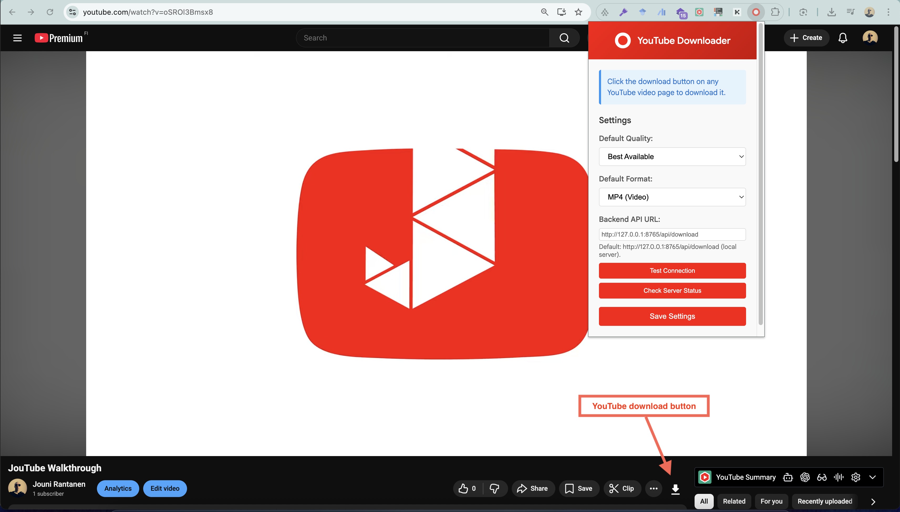
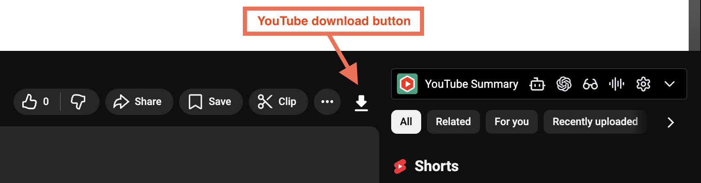

# YouTube Downloader Chrome Extension

A Chrome extension that allows you to download YouTube videos with a single click using a local backend powered by `yt-dlp`.

This project is intended as a **demo project**. Please respect YouTube's Terms of Service and only download videos you have permission to download.

## Quick Start

1. **Set up the local server** (recommended):

   ```bash
   cd local-server
   pip install -r requirements.txt
   pip install yt-dlp
   python server.py
   ```

2. **Load the extension in Chrome:**

   - Open `chrome://extensions/`
   - Enable "Developer mode"
   - Click "Load unpacked"
   - Select this folder

3. **Configure the extension:**

   - Click the extension icon
   - The backend URL is auto-filled to `http://127.0.0.1:8765/api/download`
   - Click "Check Server Status" to refresh, or "Test Connection" for details
   - Click "Save Settings" when done

4. **Download videos:**
   - Go to any YouTube video
   - Click the download button
   - Done!

See [LOCAL_SERVER_SETUP.md](LOCAL_SERVER_SETUP.md) for detailed setup instructions and troubleshooting tips.

## Features

- 🎬 One-click video download from YouTube
- 🎨 Clean, native YouTube UI integration
- ⚙️ Quality and format settings
- 📉 Automatic fallback if requested quality is unavailable
- 🔊 Audio-only (MP3) downloads supported
- 🧠 Uses yt-dlp for reliable extraction and merging
- 📱 Works with all YouTube video types

## Installation

### From Source

1. Clone or download this repository
2. Open Chrome and navigate to `chrome://extensions/`
3. Enable "Developer mode" (toggle in top-right corner)
4. Click "Load unpacked"
5. Select the `youtube-downloader` folder
6. The extension should now be installed!

## Usage

1. Navigate to any YouTube video page
2. Look for the download button next to the like/dislike buttons
3. Click the button to download the video
4. The video will be saved to your default download folder or the folder you specify in the file dialog

## UI


The download button is injected into the YouTube video page UI, styled to match YouTube's design.



## Settings

Click the extension icon in Chrome's toolbar to open the settings popup where you can configure:

- Default video quality (Best, 1080p, 720p, 480p, 360p)
- Default format (MP4, WebM, Audio only)

## Backend Service

This extension requires a **local backend server** to extract video URLs using `yt-dlp`.

The local server:

- Uses your locally installed yt-dlp
- Downloads video and audio streams
- Merges streams using ffmpeg
- Converts formats when needed
- Serves the final file to the browser

This approach avoids:

- YouTube signature decryption issues in the browser
- CORS restrictions
- Expired or encrypted streaming URLs

### Local Server (Recommended)

The included local server (`local-server/server.py`) runs on your machine and uses your locally installed `yt-dlp`. This is the recommended approach.

See [LOCAL_SERVER_SETUP.md](./local-server/LOCAL_SERVER_SETUP.md) for setup instructions.

### Cloud Services Limitations

⚠️ **Note about cloud hosting services** (Vercel, Netlify, etc.):

While technically possible, most cloud platforms introduce reliability issues:

- Execution time limits
- Missing system dependencies (ffmpeg)
- Limited filesystem access
- Restricted process execution

## Development

### File Structure

```
youtube-downloader/
├── README.md                 # This file
├── manifest.json             # Extension configuration
├── background/
│   └── service-worker.js     # Download handling logic
├── local-server/             # Local backend server
│   ├── LOCAL_SERVER_SETUP.md             # Local server setup instructions
│   └── requirements.txt      # Python dependencies
│   └── server.py             # Local server code
│   └── start-server.sh       # Script to start the server
├── content/
│   └── content-script.js     # UI injection script
├── popup/
│   ├── popup.html            # Settings popup
│   ├── popup.js              # Popup logic
│   └── popup.css             # Popup styles
├── styles/
│   └── inject.css            # Download button styles
├── icons/                    # Extension icons
└── images/                   # Logo and assets
```

### Testing

1. Start the local server
2. Load the extension in Chrome
3. Navigate to a YouTube video
4. Check that the download button appears
5. Test the download functionality
6. Check terminal output from server.py if issues occur

## Browser Compatibility

- Chrome (Manifest V3)

## Terms of Service (YouTube)

This project is a demo project. Please respect YouTube's Terms of Service and only download videos you have permission to download, no matter how low-quality, irrelevant or temporary the downloadable content may be.

You can only download:

- Your own content
- Content with permission
- Content licensed for download (like educational videos under Creative Commons or so-called "Fair Use" content, where applicable by law)

One legitimate use case is downloading your own videos to verify encoding or metadata changes made by YouTube with or without your informed consent (resolution, audio quality, AI enhancements, unwanted metadata, watermarks etc.).

## Troubleshooting

**Button doesn't appear:**

- Make sure you're on a YouTube video page (URL contains `/watch`)
- Refresh the page
- Reload the extension
- Check browser console for errors

**Download doesn't work:**

- Ensure the local server is running
- Check the Backend API URL in the popup
- Verify yt-dlp and ffmpeg are installed
- Check server logs in the terminal

**Extension doesn't load:**

- Verify manifest.json
- Check that all referenced files exist
- Reload the extension from chrome://extensions/

## License

MIT License. See [LICENSE](./LICENSE.txt) for details.
