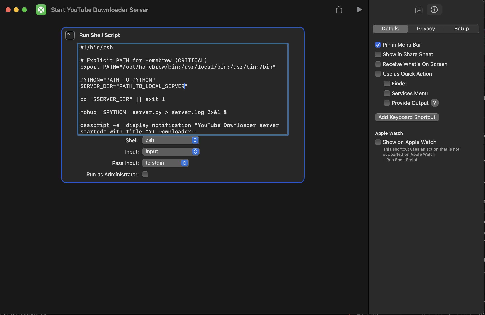
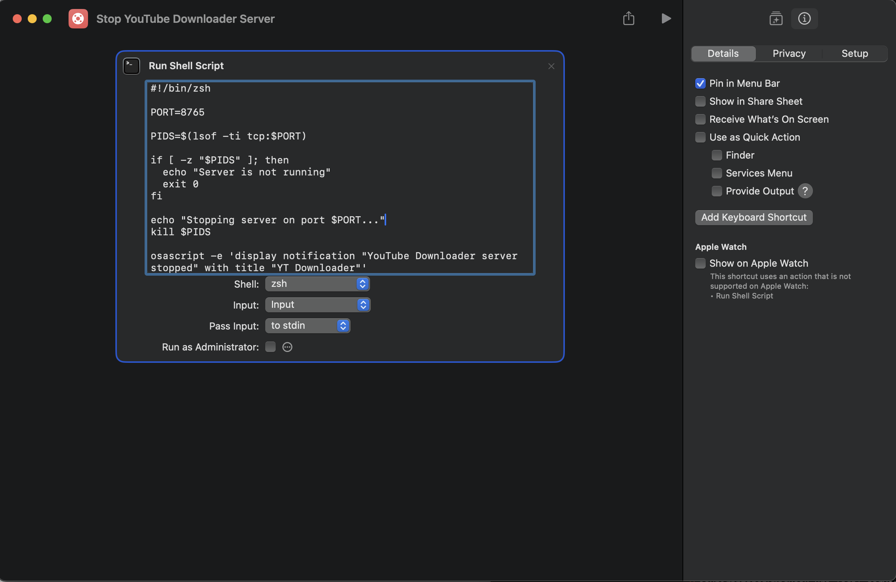

# Local Server for YouTube Downloader

This local server uses your locally installed `yt-dlp` to download and serve video/audio files from YouTube for the Chrome extension.

## Prerequisites

1. **Python 3.7+** installed
2. **yt-dlp** installed:
   ```bash
   pip install yt-dlp
   ```
3. **ffmpeg** (recommended for higher quality videos):
   - **macOS:** `brew install ffmpeg`
   - **Linux:** `sudo apt install ffmpeg` or `sudo yum install ffmpeg`
   - **Windows:** Download from https://ffmpeg.org/download.html
   - Without ffmpeg, you'll only get lower quality combined formats (usually 360p)

## Setup

1. **Install Python dependencies:**

   ```bash
   cd local-server
   pip install -r requirements.txt
   ```

2. **Verify yt-dlp is installed:**

   ```bash
   yt-dlp --version
   ```

   Or:

   ```bash
   python -m yt_dlp --version
   ```

3. **Start the server:**

   ```bash
   python server.py
   ```

   The server will start on `http://127.0.0.1:8765`

## Extension Usage

1. **Start the local server** (keep it running):

   ```bash
   python server.py
   ```

2. **Configure the Chrome extension:**

   - Open the extension popup
   - The default "Backend API URL" is set to: `http://127.0.0.1:8765/api/download`, if your server is running on the default port
   - Save settings

3. **Use the extension:**
   - Navigate to any YouTube video
   - Click the download button
   - The extension will use your local server to download and serve files from YouTube (using the video URL)

## Health Check

Check if the server is running and dependencies are available:

```bash
curl http://127.0.0.1:8765/health
```

Expected response:

```json
{
  "ffmpeg": true,
  "python": true,
  "status": "ok",
  "ytdlp": true
}
```

## API Endpoints

### GET `/api/download`

Extracts video download URL using yt-dlp.

**Parameters:**

- `videoId` (required): YouTube video ID
- `quality` (optional): Video quality (default: "best")
- `format` (optional): Video format - "mp4", "webm", or "audio" (default: "mp4")

**Example:**

```
http://127.0.0.1:8765/api/download?videoId=oSROl3Bmsx8&quality=best&format=mp4
```

### GET `/health`

Health check endpoint - shows if yt-dlp, ffmpeg and Python are available.

## Troubleshooting

### "yt-dlp not found"

- Install yt-dlp: `pip install yt-dlp`
- Or install via package manager: `brew install yt-dlp` (macOS)
- Verify: `yt-dlp --version`

- Make sure the server is running: `python server.py`
- Check the server is on port 8765
- Verify in extension settings: Default backend API URL should be `http://127.0.0.1:8765/api/download`

### Server won't start

- Check if port 8765 is already in use
- Change `PORT` in `server.py` if needed
- Make sure Python dependencies are installed: `pip install -r requirements.txt`

## Security Note

The server only listens on `127.0.0.1` (localhost) for security. It will not accept connections from other machines.

## Running in Background

### macOS/Linux:

```bash
nohup python server.py > server.log 2>&1 &
```

In macOS it is also possible to create Shortcuts apps to start and stop the local server in background and pin the Shortcuts apps into the menu bar.





In `Start YouTube Downloader Server` Shortcuts app you should replace PATH_TO_PYTHON with the path to your Python 3 executable (something like `$HOME/.pyenv/versions/3.12.0/bin/python`) and PATH_TO_LOCAL_SERVER with the path to the server.py file (in `/local-server` folder).

### Windows:

Use a terminal that supports background processes, or create a batch file.

## Auto-start on Boot (Optional)

You can set up the server to start automatically:

### macOS (using launchd):

Create `~/Library/LaunchAgents/com.youtube-downloader.server.plist`

### Linux (using systemd):

Create a systemd service file

### Windows:

Add to startup folder or use Task Scheduler
